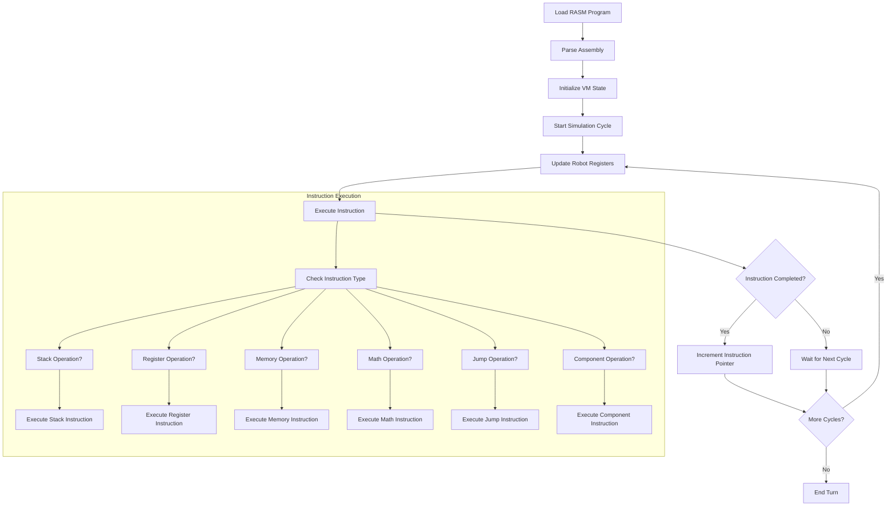
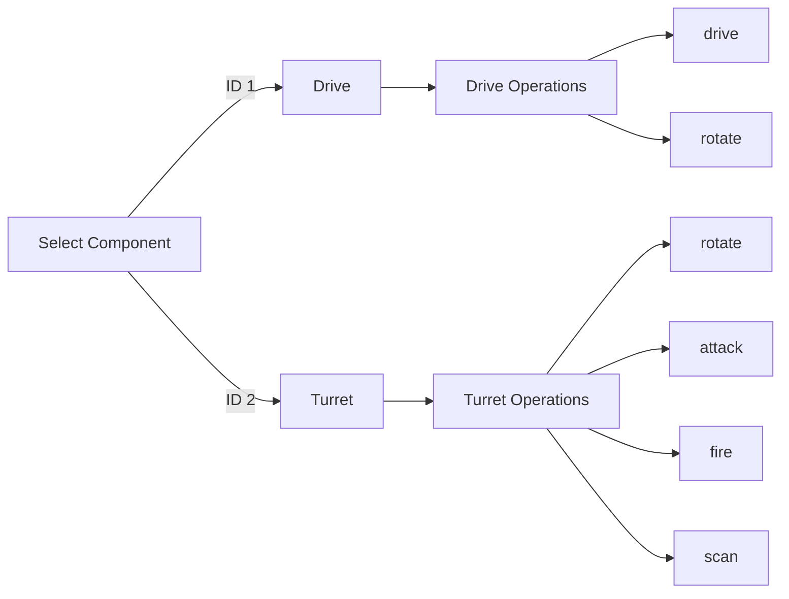
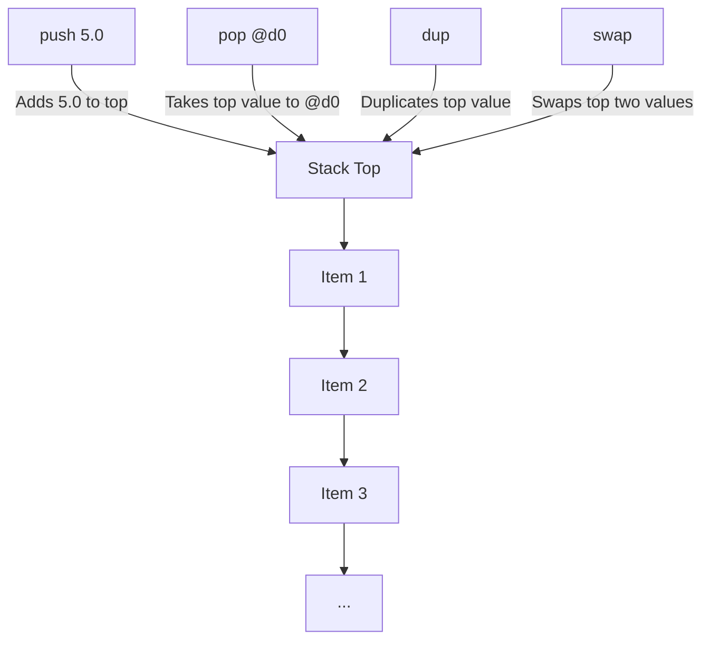

# Bot Arena Assembly Language Guide

## SYNTAX

RASM (the Bot Arena assembly language) uses a simple, flexible syntax designed for readability and ease of use. Here are the key rules:

- **One Instruction Per Line:**
  - Each line contains at most one instruction.
  - Example: `mov @d1 4`

- **Argument Separators:**
  - Arguments can be separated by spaces **or** optional commas.
  - Both of these are valid:
    - `mov @d1 4`
    - `mov @d1, 4`
    - `add @d1, @d2`
    - `add @d1 @d2`

- **Comments:**
  - Comments can start with `;`, `#`, or `//` and can appear anywhere on a line.
  - Example: `push 1.0   ; This is a comment`
  - Example: `mov @d1 4  # Set register d1 to 4`
  - Example: `add @d1, @d2 // Add d2 to d1`

- **Labels:**
  - Labels end with a colon (`:`) and must be at the start of a line (optionally followed by an instruction).
  - Example:
    - `start:`
    - `loop: add @d1, 1`
  - **Labels:**
    - Labels end with a colon (`:`) and may be indented with spaces or tabs (i.e., leading whitespace is allowed).
    - Labels do not have to start at position 0.
    - Example:
      - `start:`
      - `    loop: add @d1, 1`  ; Indented label is valid

- **Constants:**
  - Constants are defined with `.const` at the start of a line.
  - Example: `.const MAX_SPEED 1.0`
  - **You can use simple expressions when defining constants.**
    - Supported operators: `+`, `-`, `*`, `/`, `%` (modulo), and parentheses for grouping.
    - Constants can reference previously defined constants.
    - Examples:
      - `.const DOUBLE_MAX MAX * 2`
      - `.const CENTER_X (ARENA_WIDTH - 1) / 2`
      - `.const AREA ARENA_WIDTH * ARENA_HEIGHT`

- **Whitespace:**
  - Extra spaces and tabs are ignored except as argument separators.
  - Example: `   mov    @d1   ,   4   `

- **Case Insensitivity:**
  - Instructions and register names are not case-sensitive.
  - Example: `MOV @D1, 4` is the same as `mov @d1, 4`

- **Summary Example:**
  ```asm
  ; Example program
  .const MAX 10
  start:  mov @d1, MAX   # Set d1 to MAX
          add @d1, 1     // Increment d1
          jmp start      ; Loop forever
  ```

---

This document serves as both a tutorial and a reference guide for Bot Arena's custom assembly language (RASM), used to program battle robots in the Bot Arena simulation environment.

## Table of Contents

- [Overview](#overview)
- [Execution Model](#execution-model)
- [Registers](#registers)
- [Instructions](#instructions)
- [Constants](#constants)
- [Stack Operations](#stack-operations)
- [Memory Operations](#memory-operations)
- [Example Programs](#example-programs)
  - [Basic Movement](#basic-movement)
  - [Scan and Fire](#scan-and-fire)
  - [Subroutine Example](#subroutine-example)
  - [Binary Operations Example](#binary-operations-example)
  - [Memory-Based Grid Navigation](#memory-based-grid-navigation)
- [Programming Tips and Best Practices](#programming-tips-and-best-practices)

## Overview

Bot Arena's custom assembly language (RASM) is a stack-based language designed specifically for programming battle robots. Each robot runs its own program on a virtual machine that executes instructions cycle by cycle. The language provides direct control over robot components like drives and turrets, along with traditional programming constructs like jumps, comparisons, and mathematical operations.

## Execution Model



Each robot executes its program independently, with a virtual machine that processes instructions over one or more cycles. The VM maintains instruction pointers, a call stack, a data stack, and a memory array. Programs consist of instructions that manipulate registers, access memory, perform calculations, control robot components, and handle control flow.

### Instruction Cycle Costs

An important concept in the VM is that each instruction has a specific "cycle cost" - the number of simulation cycles required to complete the instruction:

- **Basic Operations** (push, pop, mov, stack operations): 1 cycle
- **Math Operations** (pow, sqrt, trigonometric functions): 2 cycles
- **Component Operations**:
  - `rotate`: 3 cycles
  - `drive`: 2 cycles
  - `fire`: 3 cycles
  - `scan`: 3 cycles
  - `attack`: 5 cycles
- **Control Flow**:
  - `call` and `ret`: 3 cycles
  - Jump instructions: 1 cycle

This means a complex instruction like `fire` will take 3 simulation cycles to complete before the VM moves on to the next instruction. During this time, other robots will continue executing their own instructions.

### Program Structure

A RASM program consists of:
- Constants (defined with `.const`)
- Labels (ending with `:`)
- Instructions

Example:
```asm
.const MAX_SPEED 1.0  ; Define constant

start:                ; Label
    mov @d0 0.0       ; Initialize @d0 to 0 (1 cycle)
    select 1          ; Select drive component (1 cycle)
    drive MAX_SPEED   ; Set drive speed using constant (2 cycles)
    jmp start         ; Jump back to start (1 cycle)
```

### Execution Cycle

The VM executes your program as follows:
1. Read the current instruction at the instruction pointer (IP)
2. Check the cycle cost of the instruction
3. Execute or continue executing the instruction, consuming one simulation cycle
4. If the instruction is completed (all required cycles consumed):
   - Update appropriate registers, stack, or robot state
   - Increment the instruction pointer (except for jump/call instructions)
5. Move to the next simulation cycle

This cycle-based execution means timing is an important consideration when programming your robot. For example, a program that uses many high-cost operations like scanning and firing will execute fewer total instructions per turn than one that uses mostly low-cost operations.

Each turn consists of multiple cycles (default: 100 cycles per turn).

## Registers

Registers are special storage locations that hold data values. The VM has several types of registers:

### General Purpose Data Registers
These registers can be both read from and written to for general-purpose storage:

| Register | Description | Read/Write |
|----------|-------------|------------|
| `@d0` - `@d18` | General purpose data registers | Read/Write |
| `@c` | Counter register (used with `loop` instruction) | Read/Write |
| `@index` | Memory index register (used with `lod` and `sto` instructions) | Read/Write |

### Status Registers
These provide information about the VM state:

| Register | Description | Read/Write |
|----------|-------------|------------|
| `@result` | Result of the last `cmp` operation | Read/Write |
| `@fault` | Error code if a VM fault occurs | Read-only |
| `@turn` | Current simulation turn number | Read-only |
| `@cycle` | Current execution cycle within the turn | Read-only |
| `@rand` | Random value between 0.0 and 1.0 | Read-only |

### Robot Status Registers
These provide information about the robot's current state:

| Register | Description | Read/Write |
|----------|-------------|------------|
| `@health` | Current health points | Read-only |
| `@power` | Current energy/power level | Read-only |
| `@posx` / `@pos_x` | Robot's X coordinate | Read-only |
| `@posy` / `@pos_y` | Robot's Y coordinate | Read-only |
| `@component` | ID of currently selected component | Read-only (set only by `select`/`deselect` instructions) |

### Component Status Registers
These provide information about the currently selected component:

| Register | Description | Read/Write |
|----------|-------------|------------|
| `@drive_direction` | Direction the drive component is facing (degrees) | Read-only |
| `@drive_velocity` | Speed the drive component is moving at (units/cycle) | Read-only |
| `@turret_direction` | Direction the selected turret is facing (degrees) | Read-only |
| `@forward_distance` | Distance to obstacle in front of the drive | Read-only |
| `@backward_distance` | Distance to obstacle behind the drive | Read-only |
| `@weapon_power` | Power setting of the selected weapon | Read-only |
| `@weapon_cooldown` | Remaining cooldown cycles for the selected weapon | Read-only |
| `@target_distance` | Distance to the last detected target from the selected scanner | Read-only |
| `@target_direction` | Absolute angle to the last detected target from the selected scanner (degrees) | Read-only |

## Instructions

### Instruction Execution Model

```mermaid
flowchart TD
    FETCH[Fetch Instruction] --> DECODE[Decode Instruction]
    DECODE --> EXECUTE[Execute Instruction]
    EXECUTE --> UPDATE[Update VM State]
    UPDATE --> NEXT[Increment IP]
    
    NEXT --> FETCH
    
    EXECUTE --> STACKOP[Stack Operation]
    EXECUTE --> REGISTEROP[Register Operation]
    EXECUTE --> MEMORYOP[Memory Operation]
    EXECUTE --> MATHOP[Math Operation]
    EXECUTE --> JUMPOP[Control Flow]
    EXECUTE --> COMPONENTOP[Component Control]
    
    STACKOP --> PUSH[Push]
    STACKOP --> POP[Pop] 
    STACKOP --> DUP[Duplicate]
    STACKOP --> SWAP[Swap]
    
    REGISTEROP --> MOV[Move]
    REGISTEROP --> CMP[Compare]
    
    MEMORYOP --> LOD[Load]
    MEMORYOP --> STO[Store]
    
    MATHOP --> ADD[Add]
    MATHOP --> SUB[Subtract]
    MATHOP --> MUL[Multiply]
    MATHOP --> DIV[Divide]
    MATHOP --> DIVMOD[Divide with Remainder]
    MATHOP --> TRIG[Trigonometry]
    MATHOP --> BINARY[Binary Operations]
    
    BINARY --> AND[and]
    BINARY --> OR[or]
    BINARY --> XOR[xor]
    BINARY --> NOT[not]
    BINARY --> SHL[shl]
    BINARY --> SHR[shr]
    
    JUMPOP --> JMP[Jump]
    JUMPOP --> CONDJUMP[Conditional Jump]
    JUMPOP --> CALL[Call Subroutine]
    JUMPOP --> RET[Return]
    JUMPOP --> LOOP[Loop]
    
    COMPONENTOP --> SELECT[Select Component]
    COMPONENTOP --> ROTATE[Rotate Component]
    COMPONENTOP --> DRIVE[Set Drive Velocity]
    COMPONENTOP --> ATTACK[Attack]
    COMPONENTOP --> FIRE[Fire Weapon]
    COMPONENTOP --> SCAN[Scan for Targets]
```



### Stack Operations

| Instruction | Description | Operands | VM Cycle Cost | Stack/Register Effects |
|-------------|-------------|----------|---------------|------------------------|
| `push <operand>` | Push a value onto the stack | Value or register | 1 | Stack: +1 item |
| `pop <register>` | Pop a value from stack into register | Register | 1 | Stack: -1 item, Register: written |
| `pop` | Pop and discard value from stack | None | 1 | Stack: -1 item |
| `dup` | Duplicate top value on stack | None | 1 | Stack: +1 item (copy of top) |
| `swap` | Swap top two values on stack | None | 1 | Stack: rearranged |

### Register Operations

| Instruction | Description | Operands | VM Cycle Cost | Stack/Register Effects |
|-------------|-------------|----------|---------------|------------------------|
| `mov <register> <operand>` | Copy value to register | Register, Value/Register | 1 | Register: written |
| `cmp <operand1> <operand2>` | Compare values, store result | Two values/registers | 1 | `@result`: written |

### Memory Operations

Memory operations allow your robot to store and retrieve values from a memory array, providing more storage beyond the limited number of registers. The VM maintains a 1024-element memory array that persists throughout program execution.

| Instruction | Description | Operands | VM Cycle Cost | Register Effects |
|-------------|-------------|----------|---------------|------------------|
| `lod <register>` | Load value from memory at `@index` position into register | Register | 1 | `@index`: auto-incremented, Register: written |
| `sto <operand>` | Store value to memory at `@index` position | Value/Register | 1 | `@index`: auto-incremented |

Memory access is controlled via the `@index` register, which points to the current memory location (0-1023). Both `lod` and `sto` operations automatically increment `@index` after execution, making it convenient to work with consecutive memory locations.

Example of using memory operations:
```asm
; Store values in consecutive memory locations
mov @index 0      ; Set memory index to position 0
sto 42.0          ; Store 42.0 at memory[0], @index becomes 1
sto 3.14          ; Store 3.14 at memory[1], @index becomes 2
sto @d5           ; Store value from register @d5 at memory[2], @index becomes 3

; Read values back from memory
mov @index 0      ; Reset memory index to position 0
lod @d0           ; Load memory[0] into @d0 (42.0), @index becomes 1
lod @d1           ; Load memory[1] into @d1 (3.14), @index becomes 2
lod @d2           ; Load memory[2] into @d2 (value from @d5), @index becomes 3
```

Memory can be used to implement arrays and more complex data structures:
```asm
; Define a 10-element array starting at position 100
mov @index 100    ; Set starting position for array
mov @c 10         ; Loop counter for 10 elements
init_array:
  sto 0.0         ; Initialize each element to 0.0
  loop init_array ; Repeat until all elements initialized

; Set value at specific array position (index 5)
mov @index 105    ; Base address (100) + index (5)
sto 42.0          ; Store 42.0 at this position

; Read value from specific array position (index 7)
mov @index 107    ; Base address (100) + index (7)
lod @d0           ; Load value into @d0
```

### Math Operations
These operations primarily work on the stack, popping operands and pushing results.
Basic arithmetic operations (`add`, `sub`, `mul`, `div`, `mod`) also have an alternative form:

**Stack Form (No Operands):** Pops required operands from the stack, pushes the result back onto the stack.
  - Example: `push 3; push 4; add` -> Stack contains `7`.

**Operand Form (Two Operands):** Takes two operands (register or literal), performs the calculation, and stores the result directly in the `@result` register *without* modifying the stack. This is useful for quick calculations where the result is immediately needed for a conditional jump or comparison.
  - Example: `add @d0 5` -> `@result` = value of `@d0` + 5. The stack is unchanged.
  - Example: `sub 10 @d1` -> `@result` = 10 - value of `@d1`. The stack is unchanged.

| Instruction | Description (Stack Form) | Operands (Stack Form) | Stack Effect (Stack Form) | Operands (Operand Form) | Effect (Operand Form) | VM Cycle Cost |
|-------------|----------------------------|-----------------------|---------------------------|-------------------------|-------------------------|---------------|
| `add`       | Add top two values         | None                  | -2, +1 items              | `<op1> <op2>`           | `@result` = op1 + op2   | 1             |
| `sub`       | Subtract top from second   | None                  | -2, +1 items              | `<op1> <op2>`           | `@result` = op1 - op2   | 1             |
| `mul`       | Multiply top two values    | None                  | -2, +1 items              | `<op1> <op2>`           | `@result` = op1 * op2   | 1             |
| `div`       | Divide second by top       | None                  | -2, +1 items              | `<op1> <op2>`           | `@result` = op1 / op2   | 1             |
| `mod`       | Modulo (remainder)         | None                  | -2, +1 items              | `<op1> <op2>`           | `@result` = op1 % op2   | 1             |
| `divmod`    | Divide and return both quotient and remainder | None | 1 | -2, +2 items | N/A | N/A | 1 |
| `pow`       | Exponentiation             | None                  | -2, +1 items              | `<base> <exp>`          | `@result` = base ^ exp  | 2             |
| `sqrt`      | Square root of top value   | None                  | -1, +1 items              | `<value>`               | `@result` = sqrt(value) | 2             |
| `log`       | Natural logarithm          | None                  | -1, +1 items              | `<value>`               | `@result` = ln(value)   | 2             |
| `sin`       | Sine (degrees)             | None                  | -1, +1 items              | `<degrees>`             | `@result` = sin(degrees)| 2             |
| `cos`       | Cosine (degrees)           | None                  | -1, +1 items              | `<degrees>`             | `@result` = cos(degrees)| 2             |
| `tan`       | Tangent (degrees)          | None                  | -1, +1 items              | `<degrees>`             | `@result` = tan(degrees)| 2             |
| `asin`      | Arc sine (result degrees)  | None                  | -1, +1 items              | `<value>`               | `@result` = asin(value) | 2             |
| `acos`      | Arc cosine (result degrees)| None                  | -1, +1 items              | `<value>`               | `@result` = acos(value) | 2             |
| `atan`      | Arc tangent (result degrees)| None                 | -1, +1 items              | `<value>`               | `@result` = atan(value) | 2             |
| `atan2`     | Two-arg arc tan (result deg)| None                | -2, +1 items              | `<y> <x>`               | `@result` = atan2(y, x)| 2             |
| `abs`       | Absolute value             | None                  | -1, +1 items              | `<value>`               | `@result` = abs(value)  | 1             |

### Binary Operations
These operations perform bitwise manipulations by first converting float values to 32-bit unsigned integers:

| Instruction | Description | Operands | VM Cycle Cost | Stack Effect |
|-------------|-------------|----------|---------------|--------------|
| `and`       | Bitwise AND of top two values | None | 1 | -2, +1 items |
| `or`        | Bitwise OR of top two values | None | 1 | -2, +1 items |
| `xor`       | Bitwise XOR of top two values | None | 1 | -2, +1 items |
| `not`       | Bitwise NOT of top value | None | 1 | -1, +1 items |
| `shl`       | Shift left value by specified bits | None | 1 | -2, +1 items |
| `shr`       | Shift right value by specified bits | None | 1 | -2, +1 items |

For binary operations, the VM:
1. Pops the required number of values from the stack (1 for `not`, 2 for others)
2. Converts each value to a `u32` (truncating any fractional part)
3. Performs the binary operation
4. Converts the `u32` result back to an `f64`
5. Pushes the final result back onto the stack

For shift operations:
- The first value popped is the number of bits to shift (right operand)
- The second value popped is the value to be shifted (left operand)
- Shift amounts greater than 31 bits are clamped to 31 to prevent undefined behavior

Binary operations also have an alternative form with operands:

**Stack Form (No Operands):** Pops required operands from the stack, pushes the result back onto the stack.
  - Example: `push 3; push 4; and` -> Stack contains `0` (3 & 4 = 0).

**Operand Form (Two Operands):** Takes two operands (register or literal), performs the calculation, and stores the result directly in the `@result` register *without* modifying the stack. This is useful for quick calculations where the result is immediately needed for a conditional jump or comparison.
  - Example: `and @d0 5` -> `@result` = value of `@d0` & 5 (as u32). The stack is unchanged.
  - Example: `shl @d0 2` -> `@result` = value of `@d0` << 2 (shifted left 2 bits). The stack is unchanged.

| Instruction | Description (Operand Form) | Operands | VM Cycle Cost | Effect |
|-------------|----------------------------|----------|---------------|--------|
| `and <op1> <op2>` | Bitwise AND of two operands | Two values/registers | 1 | `@result` = op1 & op2 |
| `or <op1> <op2>` | Bitwise OR of two operands | Two values/registers | 1 | `@result` = op1 \| op2 |
| `xor <op1> <op2>` | Bitwise XOR of two operands | Two values/registers | 1 | `@result` = op1 ^ op2 |
| `not <op>` | Bitwise NOT of operand | Value/register | 1 | `@result` = ~op |
| `shl <op1> <op2>` | Shift op1 left by op2 bits | Two values/registers | 1 | `@result` = op1 << op2 |
| `shr <op1> <op2>` | Shift op1 right by op2 bits | Two values/registers | 1 | `@result` = op1 >> op2 |

Example using binary operations:
```asm
; Stack-based form
; Check if bit 3 is set in value 42
push 42      ; 00101010 in binary
push 8       ; 00001000 in binary (bit 3)
and          ; Result: 8 if bit is set, 0 if not
pop @d0      ; Store result in @d0

; Operand-based form
; Check if bit 3 is set and jump if it is
and @d0 8    ; Performs @d0 & 8 and stores result in @result
jnz bit_set  ; Jump if bit is set (@result != 0)

; Set bit 2 in register @d1
or @d1 4     ; @result = @d1 | 4 (sets bit 2)
mov @d1 @result  ; Update @d1 with the result

; Clear bit 3 in register @d2 using XOR
and @d2 4294967287  ; @d2 & ~8 (all bits 1 except bit 3) 
                    ; 11111111 11111111 11111111 11110111
                    ; 0xFFFFFFF7 (hexadecimal)
mov @d2 @result     ; Update @d2 with result

; Double a value using shift left
shl @d3 1    ; @result = @d3 << 1 (multiply by 2)
mov @d3 @result  ; Update @d3 with the shifted value
```

### Control Flow

| Instruction | Description | Operands | VM Cycle Cost | Effect |
|-------------|-------------|----------|---------------|--------|
| `jmp <label>` | Unconditional jump | Label | 1 | IP = label position |
| `jz <label>` / `je <label>` | Jump if `@result` == 0 | Label | 1 | Conditional IP change |
| `jnz <label>` / `jne <label>` | Jump if `@result` != 0 | Label | 1 | Conditional IP change |
| `jl <label>` | Jump if `@result` < 0 | Label | 1 | Conditional IP change |
| `jle <label>` | Jump if `@result` <= 0 | Label | 1 | Conditional IP change |
| `jg <label>` | Jump if `@result` > 0 | Label | 1 | Conditional IP change |
| `jge <label>` | Jump if `@result` >= 0 | Label | 1 | Conditional IP change |
| `call <label>` | Call subroutine | Label | 3 | Push return address, IP = label |
| `ret` | Return from subroutine | None | 3 | Pop return address, jump to it |
| `loop <label>` | Decrement `@c`, jump if not zero | Label | 1 | `@c` -= 1, conditional jump |

### Component Control



| Instruction | Description | Operands | VM Cycle Cost | Required Component | Effect |
|-------------|-------------|----------|---------------|-------------------|--------|
| `select <operand>` | Select component by ID | Component ID or register | 1 | None | `@component` = component ID |
| `deselect` | Deselect current component | None | 1 | None | `@component` = 0 |
| `rotate <operand>` | Request rotation for selected component | Angle delta (degrees) | 3 | Any | Component begins rotating (applies to selected component) |
| `drive <operand>` | Set drive velocity | Target velocity | 2 | Drive (ID 1) | Drive begins accelerating/decelerating |
| `attack` | Perform melee attack | None | 5 | Turret (ID 2) | Initiates melee attack |
| `fire <operand>` | Fire ranged weapon | Power level (0.0-1.0) | 3 | Turret (ID 2) | Fires projectile |
| `scan` | Scan for targets | None | 3 | Turret (ID 2) | Updates `@target_distance` and `@target_angle` |

### Miscellaneous

| Instruction | Description | Operands | VM Cycle Cost | Effect |
|-------------|-------------|----------|---------------|--------|
| `nop` | No operation | None | 1 | None (wastes a cycle) |
| `dbg <operand>` | Print debug value | Value or register | 1 | Outputs value to console |
| `sleep <cycles>` | Pause execution for the given number of cycles | Value, register, or constant | cycles | Pauses execution for the specified number of cycles |

## Constants

Constants are defined using the `.const` directive and must be placed at the beginning of your program before they are used. Once defined, constants can be used in place of literal values throughout your program.

```asm
.const MAX_SPEED 1.0
.const MIN_SPEED 0.1
.const TURRET_ID 2
```

Constants can also be defined using expressions that combine numerical values and other constants:

```asm
.const CENTER_X ARENA_WIDTH / 2    ; Divide predefined constant by 2
.const CENTER_Y ARENA_HEIGHT / 2   ; Find center Y coordinate
.const SPEED_FACTOR 1.5            ; Define a basic value
.const MAX_SPEED SPEED_FACTOR * 2  ; Reference another constant in expression
.const AREA (ARENA_WIDTH - 1) * (ARENA_HEIGHT - 1)  ; Use parentheses for grouping
```

Expressions support:
- Basic arithmetic operators: `+`, `-`, `*`, `/`, `%` (modulo)
- Parentheses for grouping and precedence control
- References to previously defined constants
- Proper operator precedence (multiplication/division before addition/subtraction)

### Rules for Constants
- Constants are immutable (cannot be changed after definition)
- Constants must be named with ALL_CAPS
- Constants can only be defined once
- Constant values must be valid floating-point numbers or expressions evaluating to numbers
- The value is evaluated and substituted during parsing (constants are substituted at parse time, not runtime)
- Expressions can only reference constants that were defined earlier in the code

### Built-in Constants

The following constants are predefined and available to all robot programs:

| Constant | Value | Description |
|----------|-------|-------------|
| `ARENA_WIDTH` | Width of arena | Total width of the arena grid (typically 20.0) |
| `ARENA_HEIGHT` | Height of arena | Total height of the arena grid (typically 15.0) |

## Stack Operations

The Bot Arena VM uses a stack for many of its operations, particularly for mathematical calculations. Understanding stack operations is essential for effective programming.



### Stack-Based Math Example

To add 3 and 4 using stack operations:
```asm
push 3.0    ; Push 3.0 onto the stack
push 4.0    ; Push 4.0 onto the stack
add         ; Pop both values, add them, push result (7.0)
pop @d0     ; Pop result into @d0
```

## Component Selection and Control

Robots have two main components, each with different capabilities:

> **Warning:** If you attempt to use a component-specific instruction (like `drive`, `fire`, or `scan`) without first selecting the correct component, the instruction will have no effect or may cause an error.

1. **Drive** (ID 1): Controls movement
   - `drive`: Set velocity
   - `rotate`: Change direction

2. **Turret** (ID 2): Controls weapons and scanning
   - `rotate`: Change direction
   - `attack`: Melee attack
   - `fire`: Range attack
   - `scan`: Detect other robots

Before using any component-specific instruction, you must first select the appropriate component using the `select` instruction:

```asm
select 1       ; Select the drive component
drive 0.5      ; Set drive velocity to 0.5 units/cycle
rotate 45.0    ; Begin rotating the drive 45 degrees

select 2       ; Select the turret component
rotate 90.0    ; Begin rotating the turret 90 degrees
scan           ; Scan for targets
```

## Example Programs

### Basic Movement

This program makes the robot move in a square pattern:

```asm
.const DRIVE_ID 1
.const DRIVE_DELAY 800      ; Delay counter for driving
.const TURN_DELAY 20        ; Delay counter for turning

select DRIVE_ID             ; Select drive component

start:
    drive 2.0               ; Move forward
    sleep DRIVE_DELAY       ; Wait DRIVE_DELAY cycles
    drive 0.0               ; Stop
    rotate 90.0             ; Turn 90 degrees
    sleep TURN_DELAY        ; Wait TURN_DELAY cycles
    jmp start               ; Repeat
```

> **Note:** The `sleep` instruction is the preferred way to pause execution for a number of cycles. It replaces manual delay loops using `@c` and `loop`.

### Memory-Based Grid Navigation

This program demonstrates using memory to maintain a grid map of the environment and implement pathfinding:

```asm
.const GRID_WIDTH 10
.const GRID_HEIGHT 10
.const GRID_SIZE 100       ; GRID_WIDTH * GRID_HEIGHT
.const GRID_BASE_ADDR 0    ; Base memory address for grid

.const EMPTY 0.0
.const OBSTACLE 1.0
.const VISITED 2.0
.const PATH 3.0

.const DRIVE_ID 1
.const TURRET_ID 2

start:
    ; Initialize grid to empty
    call init_grid
    
    ; Mark current position (center of grid)
    mov @d0 5               ; x = 5
    mov @d1 5               ; y = 5
    call mark_current_pos
    
    ; Scan surroundings and mark obstacles
    call scan_surroundings
    
    ; Main robot control loop
    main_loop:
        ; Determine next best move
        call find_next_move
        
        ; Check if we have a valid move
        cmp @result 0.0
        jz no_valid_move
        
        ; Move in the direction specified by @d5
        select DRIVE_ID
        rotate @d5
        drive 0.5
        
        ; Wait for movement to complete
        sleep 10
        
        ; Update position and scan again
        call update_position
        call scan_surroundings
        
        jmp main_loop
    
    no_valid_move:
        ; No valid move, stop and rotate to find a path
        select DRIVE_ID
        drive 0.0
        rotate 45.0
        jmp main_loop

; Subroutine: Initialize grid to empty
init_grid:
    mov @index GRID_BASE_ADDR
    mov @c GRID_SIZE
    init_loop:
        sto EMPTY
        loop init_loop
    ret

; Subroutine: Convert x,y to grid index and mark position
; Input: @d0 = x, @d1 = y, @d2 = value to store
mark_grid_pos:
    ; Calculate grid index: y * GRID_WIDTH + x
    push @d1
    push GRID_WIDTH
    mul
    push @d0
    add
    push GRID_BASE_ADDR
    add
    pop @d3               ; @d3 = grid index
    
    ; Store value at calculated grid position
    mov @index @d3
    sto @d2
    ret

; Subroutine: Mark current position
mark_current_pos:
    mov @d2 PATH          ; Value to store
    call mark_grid_pos
    ret

; Subroutine: Scan surroundings and update grid
scan_surroundings:
    ; Save current position
    push @d0
    push @d1
    
    ; Select turret and do a 360-degree scan
    select TURRET_ID
    
    ; Scan in 8 directions (45 degree increments)
    mov @d6 0.0           ; Current angle
    mov @c 8              ; 8 directions to scan
    
    scan_loop:
        ; Rotate turret to scan angle
        rotate @d6
        
        ; Wait for rotation
        sleep 5
        
        ; Scan for obstacles
        scan
        
        ; Check if we detected something
        cmp @target_distance 0.0
        jz no_obstacle
        
        ; Calculate obstacle position based on distance and angle
        push @target_distance
        push @d6
        cos
        mul
        pop @d8            ; dx = distance * cos(angle)
        
        push @target_distance
        push @d6
        sin
        mul
        pop @d9            ; dy = distance * sin(angle)
        
        ; Calculate obstacle position relative to current position
        push @d0
        push @d8
        add
        pop @d8            ; obstacle_x = current_x + dx
        
        push @d1
        push @d9
        add
        pop @d9            ; obstacle_y = current_y + dy
        
        ; Mark obstacle on grid
        push @d0
        push @d1
        mov @d0 @d8
        mov @d1 @d9
        mov @d2 OBSTACLE
        call mark_grid_pos
        pop @d1
        pop @d0
        
        no_obstacle:
        ; Increment angle for next scan
        push @d6
        push 45.0
        add
        pop @d6
        
        loop scan_loop
    
    ; Restore current position
    pop @d1
    pop @d0
    ret

; Subroutine: Find next move based on grid data
; Output: @result = 1.0 if valid move found, @d5 = direction to move
find_next_move:
    ; Simple algorithm: check 4 adjacent cells and move to empty one
    ; Priority: North, East, South, West
    
    ; Check North
    push @d0
    push @d1
    push 1.0
    sub
    pop @d1            ; y - 1
    
    ; Get value at this position
    push @d1
    push GRID_WIDTH
    mul
    push @d0
    add
    push GRID_BASE_ADDR
    add
    pop @d3           ; grid index
    
    mov @index @d3
    lod @d4           ; @d4 = grid value
    
    ; If empty, move north
    cmp @d4 EMPTY
    jnz not_north
    mov @d5 0.0       ; North direction
    mov @result 1.0   ; Valid move found
    pop @d1
    pop @d0
    ret
    
    not_north:
    pop @d1
    pop @d0
    
    ; Similar checks for East, South, West...
    ; (abbreviated for brevity)
    
    ; No valid move found
    mov @result 0.0
    ret

; Subroutine: Update current position based on movement
update_position:
    ; This would need odometry or some way to determine new position
    ; Simplified version just updates the stored position
    push @d0
    push @d1
    
    ; Mark old position as visited
    mov @d2 VISITED
    call mark_grid_pos
    
    ; Update position based on current direction
    push @drive_direction
    cos
    push 1.0
    mul
    push @d0
    add
    pop @d0           ; x += cos(direction)
    
    push @drive_direction
    sin
    push 1.0
    mul
    push @d1
    add
    pop @d1           ; y += sin(direction)
    
    ; Mark new position
    mov @d2 PATH
    call mark_grid_pos
    
    pop @d1
    pop @d0
    ret

### Scan and Fire

This program rotates the turret, scans for targets, and fires when a target is detected:

```asm
.const TURRET_ID 2
.const ROTATION_SPEED 10.0
.const MAX_WEAPON_POWER 1.0
.const DETECTION_RANGE 0.5

start:
    mov @d0 0.0     ; Scan counter
    
main_loop:
    select TURRET_ID
    rotate ROTATION_SPEED
    scan
    cmp @target_distance @DETECTION_RANGE
    jg no_target     ; If @target_distance > DETECTION_RANGE, no target in range
    fire MAX_WEAPON_POWER

no_target:
    push @d0
    push 1.0
    add
    pop @d0
    sleep 3
    jmp main_loop
```

### Subroutine Example

This program demonstrates using subroutines with `call` and `ret` instructions:

```asm
.const DRIVE_ID 1
.const TURRET_ID 2
.const SCAN_ANGLE 45.0

start:
    mov @d0 0.0    ; Main loop counter
    
main_loop:
    push @d0
    push 1.0
    add
    pop @d0
    call zigzag
    call scan_and_fire
    mov @c 5
    sleep 5
    jmp main_loop

zigzag:
    push @d4
    select DRIVE_ID
    drive 0.5
    push @d0
    push 180.0
    mul
    pop @d4
    push @d4
    sin
    pop @d4
    push @d4
    push 45.0
    mul
    pop @d4
    rotate @d4
    pop @d4
    ret

scan_and_fire:
    push @d5
    select TURRET_ID
    rotate SCAN_ANGLE
    scan
    cmp @target_distance 0.3
    jg no_target_detected
    fire 1.0

no_target_detected:
    pop @d5
    ret
```

### Binary Operations Example

This program demonstrates using binary operations for bit manipulation:

```asm
.const BIT_0 1
.const BIT_1 2
.const BIT_2 4
.const BIT_3 8
.const BIT_4 16
.const BIT_5 32
.const BIT_6 64
.const BIT_7 128

start:
    mov @d0 0.0  ; Start with all bits clear
    push @d0
    push BIT_0   ; Set bit 0
    or
    push BIT_2   ; Set bit 2
    or
    push BIT_5   ; Set bit 5
    or
    pop @d0      ; @d0 now contains: 00100101 (37)
    dbg @d0      ; Display the value
    push @d0
    push BIT_2   ; Check bit 2
    and
    pop @d1      ; @d1 will be 4 (bit is set)
    dbg @d1
    push @d0
    push BIT_1   ; Check bit 1
    and
    pop @d2      ; @d2 will be 0 (bit is not set)
    dbg @d2
    push @d0
    push BIT_0   ; Toggle bit 0 (was set, now clear)
    xor
    push BIT_1   ; Toggle bit 1 (was clear, now set)
    xor
    pop @d3      ; @d3 now contains: 00100110 (38)
    dbg @d3
    mov @d4 0.0
    push @d4
    push BIT_2   ; Set bit 2
    or
    push BIT_3   ; Set bit 3
    or
    pop @d4      ; @d4 now contains: 00001100 (12)
    push @d3     ; Value: 00100110 (38)
    push @d4     ; Mask:  00001100 (12)
    and
    pop @d5      ; @d5 now contains: 00000100 (4)
    dbg @d5
    mov @d6 85   ; 01010101
    push @d6
    not          ; Inverts bits -> 10101010 (for the lower 8 bits)
                ; Full 32-bit result depends on higher bits being zero initially
                ; Result would be 0xFFFFFFAA (as u32) -> converted to f64
    pop @d7
    dbg @d7      ; Display the floating point representation of the inverted bits
    mov @d8 1.0  ; 00000001 (1)
    push @d8
    push 3       ; Shift left by 3 bits
    shl          ; 00001000 (8)
    pop @d9
    dbg @d9
    push @d9
    push 1       ; Shift right by 1 bit
    shr          ; 00000100 (4)
    pop @d10
    dbg @d10
    mov @d11 0.0
    push @d11
    push 1       ; 00000001
    or           ; Set bit 0
    push 2       ; Shift amount
    shl          ; 00000100
    or           ; Set bit 2
    push 2       ; Shift amount
    shl          ; 01000000
    or           ; Set bit 4
    push 2       ; Shift amount
    shl          ; 01010101
    or           ; Set bit 6
    pop @d11     ; @d11 now contains: 01010101 (85)
    dbg @d11

loop:
    jmp loop    ; Loop forever
```